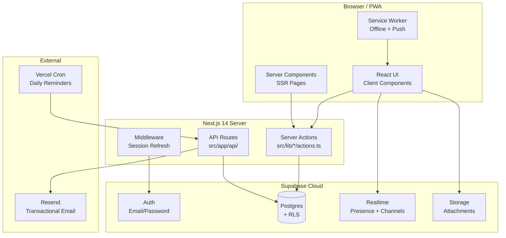
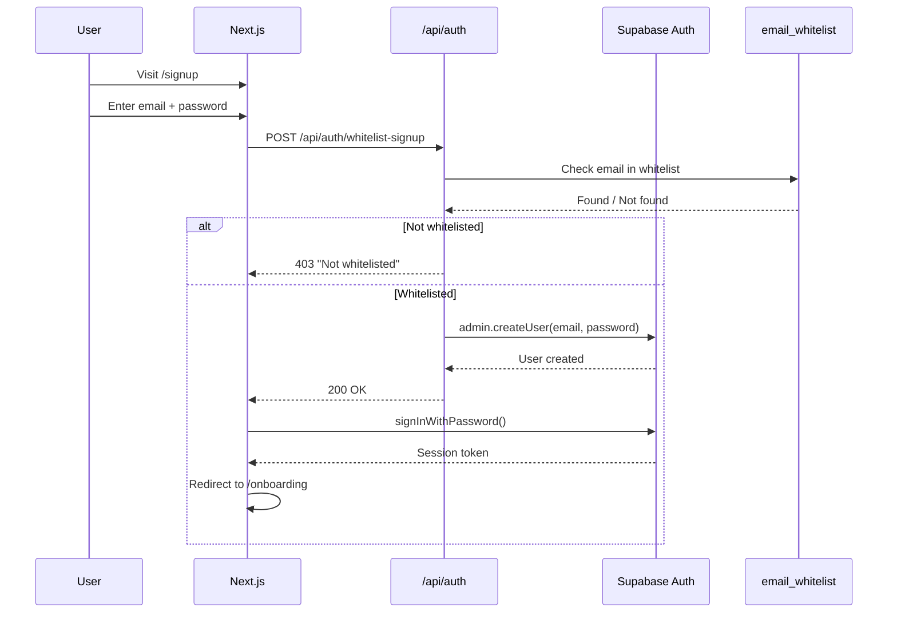
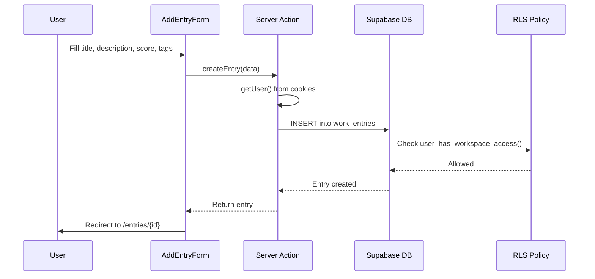
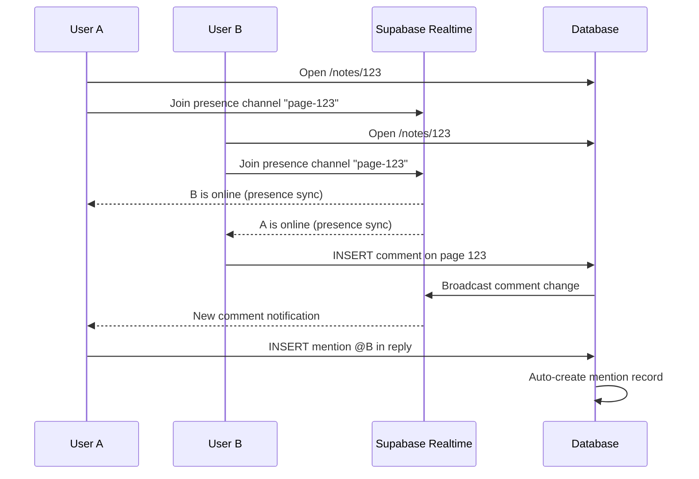
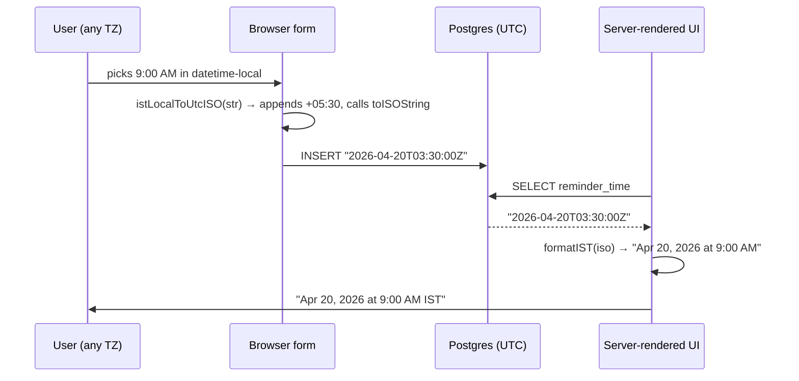
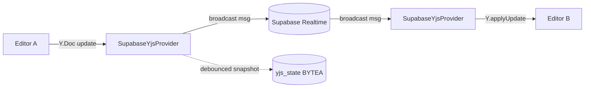

# Trackify — Technical Documentation

Complete technical reference for the Trackify codebase. Covers architecture, data flow, every table, every server action, and deployment.

---

## System Architecture



## Authentication Flow



## Data Flow: Creating a Work Entry



## Collaboration Flow



---

## Database Tables Reference

### Core Tables

| Table | Columns | Purpose |
|-------|---------|---------|
| `workspaces` | id, name, slug, description, created_by, is_personal, created_at, updated_at | Multi-tenant workspace container |
| `workspace_members` | id, workspace_id, user_id, role, joined_at | Maps users to workspaces with roles |
| `workspace_invitations` | id, workspace_id, email, role, invited_by, token, accepted_at, expires_at | Pending invitations |
| `email_whitelist` | id, email, created_at | Approved emails for signup |
| `user_profiles` | user_id, name, avatar_url, timezone, theme_preference, created_at, updated_at | User profile data |

### Work Tracking

| Table | Columns | Purpose |
|-------|---------|---------|
| `work_entries` | id, user_id, workspace_id, title, description, work_done, date, status, productivity_score, hours, created_at, updated_at | Daily work logs |
| `tasks` | id, user_id, workspace_id, title, description, due_date, due_time, status, priority, completed_at, board_id, column_id, position, assigned_to, parent_task_id, labels, created_at, updated_at | Task items |
| `boards` | id, workspace_id, name, description, created_by, created_at, updated_at | Kanban boards |
| `board_columns` | id, board_id, name, position, color, created_at | Board columns |
| `tags` | id, workspace_id, name, color, created_at | Categorization tags |
| `entry_tags` | id, entry_id, tag_id | Entry-tag junction |
| `attachments` | id, entry_id, user_id, file_url, file_name, file_type, file_size, created_at | File attachments |

### Content

| Table | Columns | Purpose |
|-------|---------|---------|
| `pages` | id, workspace_id, title, content (JSONB), icon, cover_url, parent_page_id, created_by, last_edited_by, is_archived, is_template, created_at, updated_at | Rich notes (BlockNote) |
| `mindmaps` | id, workspace_id, title, description, nodes (JSONB), edges (JSONB), viewport (JSONB), created_by, created_at, updated_at | Visual mind maps |
| `drawings` | id, workspace_id, title, data (JSONB), thumbnail_url, created_by, created_at, updated_at | tldraw canvases |

### Schedule & Reminders

| Table | Columns | Purpose |
|-------|---------|---------|
| `reminders` | id, user_id, workspace_id, title, description, reminder_time, is_recurring, recurrence_pattern, is_completed, completed_at, is_private, created_at | Time-based reminders |
| `calendar_events` | id, workspace_id, title, start_time, end_time, all_day, color, location, description, created_by, recurrence_rule, created_at, updated_at | Calendar events |
| `timer_sessions` | id, user_id, workspace_id, started_at, ended_at, duration_seconds, label, created_at | Focus timer sessions |

### Collaboration

| Table | Columns | Purpose |
|-------|---------|---------|
| `comments` | id, workspace_id, user_id, entity_type, entity_id, parent_comment_id, content, resolved, resolved_by, created_at, updated_at | Threaded comments |
| `mentions` | id, workspace_id, comment_id, entity_type, entity_id, mentioned_user_id, mentioned_by, seen, created_at | @mention tracking |
| `shared_links` | id, workspace_id, entity_type, entity_id, created_by, token, permission, password_hash, expires_at, is_active, created_at | Public share links |
| `cursor_positions` | id, workspace_id, user_id, entity_type, entity_id, cursor_data (JSONB), updated_at | Real-time cursors |
| `notifications` | id, workspace_id, user_id, type, title, message, entity_type, entity_id, is_read, created_at | In-app notifications |
| `requests` | id, workspace_id, from_user_id, to_user_id, type, title, description, status, related_entity_type, related_entity_id, due_date, responded_at, created_at | Team requests |

### Admin & Feedback

| Table | Columns | Purpose |
|-------|---------|---------|
| `whitelist_requests` | id, email, name, reason, status, created_at | Public access requests |
| `user_feedback` | id, user_id, email, name, type, message, rating, status, created_at | User feedback |

### Advanced Features

| Table | Columns | Purpose |
|-------|---------|---------|
| `habits` | id, user_id, workspace_id, name, description, frequency, target_count, color, is_active | Habit tracking |
| `habit_logs` | id, habit_id, date, count, notes | Daily habit logs |
| `goals` | id, user_id, workspace_id, title, description, target_date, status, progress | Goals with milestones |
| `goal_milestones` | id, goal_id, title, is_completed, completed_at | Goal milestones |
| `task_dependencies` | id, task_id, depends_on, dependency_type | Task dependency graph |
| `task_automations` | id, workspace_id, name, trigger_type, trigger_config, action_type, action_config, is_active | Task automation rules |
| `daily_motivations` | id, user_id, workspace_id, date, quote, reflection, gratitude, mood | Daily motivation entries |

---

## Server Actions Reference

### Work Entries (`src/lib/entries/`)
- Server-rendered CRUD via Supabase server client

### Tasks (`src/lib/tasks/advanced-actions.ts`)
- `createSubtask(parentTaskId, data)` — Create child task
- `getSubtasks(taskId)` — Fetch subtasks
- `getTaskDependencies(taskId)` — Dependency graph
- `runAutomations(taskId, trigger)` — Execute task automations

### Boards (`src/lib/boards/actions.ts`)
- `createBoard(workspaceId, name, description)`
- `createColumn(boardId, name)`
- `createBoardTask(columnId, title)`
- `moveTask(taskId, newColumnId, newPosition)`
- `reorderColumns(boardId, orderedIds)`

### Notes (`src/lib/notes/actions.ts`)
- `createPage(workspaceId, title?, parentId?)`
- `updatePageContent(pageId, content)`
- `updatePageTitle(pageId, title)`
- `updatePageMeta(pageId, {icon, cover_url})`

### Workspace (`src/lib/workspace/actions.ts`)
- `getActiveWorkspaceId()` — From cookies
- `createPersonalWorkspace(userId, name)`
- `inviteMember(workspaceId, email, role)`
- `acceptInvitation(token)`

### Collaboration (`src/lib/collaboration/`)
- `addComment(workspaceId, entityType, entityId, content, parentId?)`
- `resolveComment(commentId, workspaceId)`
- `getMentions(workspaceId, userId)`
- `markMentionSeen(mentionId)`
- `createSharedLink(workspaceId, entityType, entityId, permission, expiresAt?)`
- `revokeSharedLink(linkId, workspaceId)`

### Smart Features (`src/lib/smart/actions.ts`)
- `getRecentItems(limit)` — Cross-entity recent activity
- `duplicatePage(pageId)` — Clone a page
- `createPageFromTemplate(templateId)` — From templates
- `getPageTemplates()` — Available templates

### Admin (`src/lib/admin/`)
- `requireAdmin()` — Gate check for admin email
- `getPlatformMetrics()` — Aggregate counts
- `getAllUsers()` — Users with activity stats
- `getDailyActivity()` — 30-day activity chart data
- `getTaskAnalytics()` / `getEntryAnalytics()`
- `getUserDetail(userId)` — Full user breakdown
- `addToWhitelist(email, sendInvite)`
- `sendBroadcast(subject, message)` — Email all users
- `approveWhitelistRequest(requestId)`

### Feedback (`src/lib/feedback/actions.ts`)
- `submitFeedback({type, message, rating})`
- `submitWhitelistRequest({email, name?, reason?})`

---

## API Routes

| Route | Method | Auth | Purpose |
|-------|--------|------|---------|
| `/api/auth/whitelist-login` | POST | None | Check email against whitelist |
| `/api/auth/whitelist-signup` | POST | None | Create user if whitelisted |
| `/api/cron/daily-entry-reminder` | GET | Bearer CRON_SECRET | Send daily reminder emails |
| `/api/collaboration/share/[token]` | GET | None | Resolve shared link to entity data |

---

## RLS (Row Level Security) Model

```
user_has_workspace_access(workspace_id, min_role)
  → Checks if auth.uid() is a member of the workspace
  → With at least the specified role (viewer < editor < admin < owner)
```

All data tables enforce workspace-scoped access:
- **SELECT**: `viewer` or higher
- **INSERT**: `viewer` or higher + `auth.uid() = user_id`
- **UPDATE**: `owner` of record or `admin` role
- **DELETE**: `owner` of record or `admin` role

---

## Migrations

Run in order in Supabase SQL Editor:

| # | File | Creates |
|---|------|---------|
| 001 | `001_initial_schema.sql` | work_entries, tags, email_whitelist, attachments, RLS |
| 002 | `002_seed_tags.sql` | Default tags (Frontend, Backend, etc.) |
| 003 | `003_seed_whitelist.sql` | Sample whitelist emails |
| 004 | `004_phase2_features.sql` | user_profiles, tasks, reminders, timer_sessions, daily_motivations |
| 005 | `005_storage_bucket.sql` | Supabase Storage bucket for attachments |
| 006 | `006_habits_goals.sql` | habits, habit_logs, goals, goal_milestones |
| 007 | `007_workspaces_rbac.sql` | workspaces, workspace_members, invitations, RBAC function |
| 008 | `008_kanban_boards.sql` | boards, board_columns, task board fields |
| 009 | `009_pages.sql` | pages (notes) |
| 010 | `010_mindmaps_activity.sql` | mindmaps, activity_log |
| 011 | `011_notifications_requests.sql` | notifications, requests |
| 012 | `012_calendar_bookings_drawings.sql` | calendar_events, bookings, drawings |
| 013 | `013_collaboration.sql` | comments, mentions, shared_links, cursor_positions, realtime |
| 014 | `014_personal_spaces.sql` | is_private flags, personal dashboard config |
| 015 | `015_advanced_tasks.sql` | task_dependencies, task_automations |
| 016 | `016_connectors.sql` | External integrations/webhooks |
| 017 | `017_feedback_whitelist_requests.sql` | whitelist_requests, user_feedback |
| 018 | `018_system_logs.sql` | `system_logs` table for admin observability |
| 019 | `019_push_subscriptions.sql` | `push_subscriptions` for web-push / PWA |
| 020 | `020_reminders_notified_at.sql` | `reminders.notified_at` for cron idempotency |
| 021 | `021_fts_search.sql` | Full-text search across work_entries |
| 022 | `022_avatars_bucket.sql` | Storage bucket for user avatars |
| 023 | `023_timer_session_title.sql` | `timer_sessions.title` |
| 024 | `024_challenges.sql` | `challenges` table with day-level progress |
| 025 | `025_realtime_members.sql` | Realtime broadcast for workspace_members |
| 026 | `026_realtime_entities.sql` | Realtime broadcast for content tables |
| 027 | `027_tighten_invitation_rls.sql` | Stricter RLS on workspace invitations |
| 028 | `028_entry_hours_and_tag_fts.sql` | `hours_worked` column + tag text in FTS |
| 029 | `029_user_last_activity.sql` | `last_activity_at` column + `touch_user_activity()` RPC |
| 030 | `030_backfill_ist_reminders.sql` | One-shot backfill for wrongly-stored task-auto reminders |
| 031 | `031_reminder_push_retry.sql` | `push_attempts` with 3-strike ceiling |
| 032 | `032_yjs_collab_state.sql` | `yjs_state BYTEA` on drawings/mindmaps/pages |
| 033 | `033_workspace_shared_write.sql` | Workspace-shared UPDATE/DELETE with privacy check |
| 034 | `034_user_preferences.sql` | `user_profiles.preferences` JSONB |
| 035 | `035_sharing_security_fixes.sql` | `shared_links.entity_type` CHECK includes `'challenge'` |

---

## Post-028 Architecture Additions

### IST datetime pipeline

All reminder / task-due / calendar event times are **interpreted and displayed in IST** regardless of the runtime timezone (Vercel is UTC). Centralised in `src/lib/utils/datetime.ts`:



The original bug was `new Date("2026-04-20T09:00:00").toISOString()` on Vercel — it interpreted the string as UTC local and stored 09:00Z instead of 03:30Z, firing reminders at 14:30 IST. Migration 030 backfills affected rows.

### Yjs CRDT transport

Real-time collab on drawings / mindmaps / notes without a new server:



- Binary state persisted to `yjs_state BYTEA` on each entity table (migration 032).
- On provider mount: load snapshot → apply → broadcast `sync-request` → peers reply with full state. From then on only deltas are transmitted.
- Canvas cursors use **scene coordinates** (stored in Yjs awareness) so pan/zoom is per-user.

### Workspace-shared write model

Migration 033 relaxed UPDATE/DELETE on tasks / work_entries / boards / pages / mindmaps / drawings to `editor+`-with-privacy-check:

```sql
USING (
  public.user_has_workspace_access(workspace_id, 'editor')
  AND (is_private = false OR owner = auth.uid())
)
```

Server actions dropped `.eq("user_id", auth.uid())` forced filters for these tables. Reminders kept their per-user scope so push notifications stay private.

### Link sharing

`/api/collaboration/share/[token]` uses the service-role client for public reads, with a **privacy gate**: refuses to return `is_private = true` entities even when a valid share token exists (defense-in-depth; `createSharedLink` also refuses creation against private items). Response is **field-filtered** per `entity_type` — the API returns exactly what the read-only preview renders, nothing more.

Audit + revoke at `/workspace/shared-links` — surfaces every active link in the workspace with creator, entity, permission, expiry; workspace admins can revoke any link, members can revoke links they created (RLS in migration 013).

### User preferences

`user_profiles.preferences` JSONB (migration 034) holds: `landingPage`, `listDensity`, `accentColor`, `fabVisible`, `defaultTaskView`, `defaultCalendarView`. Read via `getUserPreferences()` (always returns full object with defaults filled in), written via `updateUserPreferences(patch)` (RMW-merge so partial updates don't wipe unknown keys).

Client provider in `src/lib/preferences/provider.tsx` applies density (`html[data-density]`) and accent (`--accent` CSS var) on first paint via `PreferencesBootstrap`.

### Smart mindmap

`src/lib/smart-mindmap/graph.ts` builds a cross-entity graph per page load:

- **Nodes**: tasks + reminders + entries + pages (capped at 50, proportional per kind).
- **Edges**: parent-child (from `tasks.parent_task_id`), task-reminder (from `reminders.entity_type/entity_id`), same-board (from `tasks.board_id`/`column_id`), shared-tag (from `entry_tags`), keyword similarity (TF-IDF over user's own corpus, cap 0.12), same-day cross-kind.
- **Suggestions** ranked by priority: `batch-complete-overdue` (100) → `complete-overdue-reminder` (90) → `set-due-from-reminder` (70) → `create-reminder-from-task` (60) → `create-entry-for-task` (40) → `archive-stale-task` (20).
- **Overview** computed once: task/reminder/entry/page totals, overdue counts, due-this-week, stale-task count.

Rendered by `src/components/mindmaps/smart-mindmap.tsx` with ELK layered layout, color-by kind/urgency/status/priority, edge-reason tooltip, date-window filter, title search. Embedded collapsibly at the top of `/mindmaps`.
